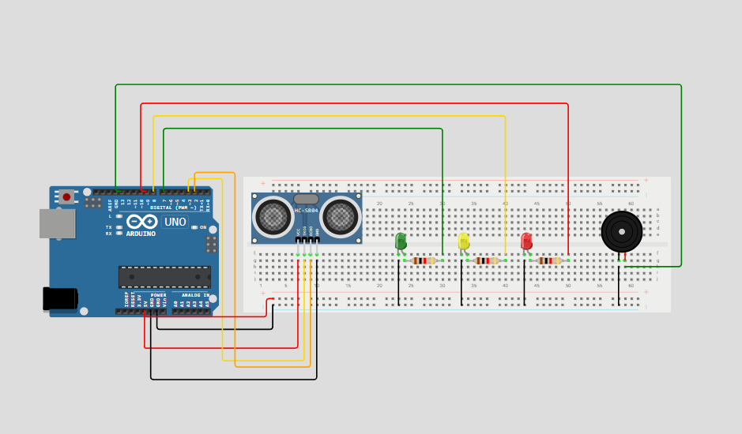

# Edge-Computing-E-IoT

## Descrição do Problema

Enchentes e inundações são desastres naturais que causam perdas incalculáveis, tanto materiais quanto humanas. A falta de um sistema de alerta precoce eficaz deixa comunidades vulneráveis, resultando em destruição de propriedades, deslocamento de famílias e, em casos extremos, perda de vidas. A imprevisibilidade e a rapidez com que os rios podem transbordar exigem uma solução proativa e em tempo real.

## Visão Geral da Solução

Este projeto utiliza um sensor ultrassônico para medir a distância até um objeto e aciona LEDs e um buzzer conforme a distância detectada:

- **LED Verde**: Distância segura (>= 300 cm)
- **LED Amarelo**: Alerta (150 cm <= distância < 300 cm)
- **LED Vermelho + Buzzer**: Nível crítico (< 150 cm)

O sistema exibe as leituras no monitor serial e pode ser facilmente adaptado para diferentes aplicações de monitoramento.

### Esquema Ilustrativo

- **Sensor Ultrassônico**: TRIG pino (3) e ECHO pino (2)
- **LEDs**: Verde pino (7), Amarelo pino (8), Vermelho pino (9)
- **Buzzer**: Pino 13

### Instruções de Montagem

1. Conecte o sensor ultrassônico aos pinos 2 (ECHO) e 3 (TRIG) do Arduino.
2. Conecte os LEDs aos pinos 7 (verde), 8 (amarelo) e 9 (vermelho), cada um com resistor de 220Ω.
3. Conecte o buzzer ao pino 13.
4. Faça o upload do código `app.c` para o Arduino.

## Guia para Simular no Wokwi

1. Acesse o [projeto no Wokwi](https://wokwi.com/projects/432255316715902977).
2. Clique em "Start Simulation" para iniciar.
3. Observe os LEDs e o buzzer reagindo conforme a distância simulada no sensor ultrassônico.
4. Utilize o controle deslizante do sensor para alterar a distância e testar os diferentes níveis de alerta.

## Links Úteis

- **Projeto no Wokwi:** [https://wokwi.com/projects/EXEMPLO_LINK](https://wokwi.com/projects/432255316715902977)
- **Vídeo Demonstrativo:** [https://youtu.be/EXEMPLO_VIDEO](https://www.youtube.com/watch?v=THpc2-3jk6Q&list=PLf_bST13H9Lx9rX8eosl5JDiN7IATsBRn&index=2)
